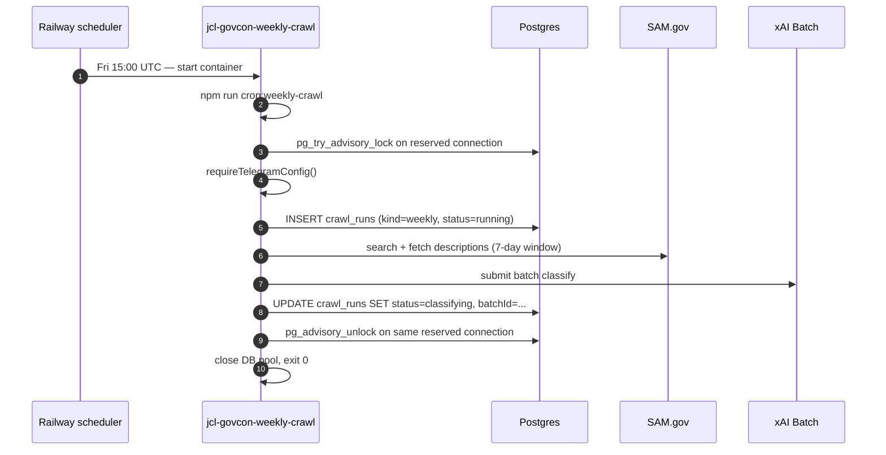

# Railway deployment — three-service architecture

## 1. Topology

JCL GovCon runs as three Railway services in a single project, all backed by the same GitHub repo (`jcl-govcon`). The web app is always on; the cron services are ephemeral — they wake on schedule, run one task, and exit.

| Service                    | Role                                                                          | Build                                       | Runtime          | Schedule                      |
| -------------------------- | ----------------------------------------------------------------------------- | ------------------------------------------- | ---------------- | ----------------------------- |
| `jcl-govcon-web`           | Always-on Next.js webapp (dashboard, API routes, cron route handlers)         | nixpacks via `railway.toml`                 | persistent       | n/a                           |
| `jcl-govcon-weekly-crawl`  | Runs the weekly SAM.gov crawl + xAI batch submission                          | Railpack Node worker runtime; explicit no-op build command skips the full Next build | runs once, exits | `0 15 * * 5` (Fri 15:00 UTC)  |
| `jcl-govcon-check-batches` | Polls in-flight xAI batches, imports on completion, fires the Telegram digest | `dockerfiles/cron.Dockerfile` (alpine+curl) | runs once, exits | `*/30 * * * *` (every 30 min) |

Postgres lives alongside as the fourth Railway service; all three app services read `DATABASE_URL` from its reference variable.

### Weekly-crawl fire sequence



`check-batches` follows the same shape but polls xAI, imports results when ready, fires the weekly digest exactly once per succeeded run (gated by `digest_sent_at`), and atomic-claims rows (`processing_at` + 5-min lease) to prevent double-processing.

## 2. Why this shape

**The Sedgewick failure mode.** The prior `railway.toml` declared crons as `[[cron]]` array-of-tables blocks. That schema is not part of Railway's current config — Railway parsed the TOML without error and silently ignored the blocks. The weekly pipeline ran exactly once (a manual curl on 2026-04-16) and never fired on schedule. The first scheduled Monday after deploy (2026-04-20) passed silently. Root cause was not a Railway bug; it was a schema-validation gap in the PR review.

**Three services not one.** Keeping crons as separate Railway services decouples their lifecycle from the always-on web process. The weekly crawl now runs as a Node worker so Railway's cron deployment status reflects the real crawl/batch-submit outcome instead of an HTTP edge response; `check-batches` remains the lightweight alpine+curl trigger.

**Public URL for check-batches.** `check-batches` reaches `jcl-govcon-web` through the public `*.up.railway.app` URL. At <100 fires/week the extra latency is a non-issue, while private networking introduces port-discovery, HTTP-vs-HTTPS handling, and service-to-service auth wrinkles that aren't worth the overhead at this volume. Weekly crawl no longer uses HTTP for the scheduled path.

Railway cron docs: <https://docs.railway.com/reference/cron-jobs>.

## 3. Provisioning a cron service

After the PR landing these files merges to `main`, the two cron services still need to be created in the Railway dashboard — config-as-code governs an existing service, it does not create one. Steps for each of `jcl-govcon-weekly-crawl` and `jcl-govcon-check-batches`:

1. **New Service → Deploy from GitHub Repo → `jcl-govcon`.** Same repo as the web service. Railway offers to deploy the default `railway.toml`; override in the next step.
2. **Settings → Name.** Set to `jcl-govcon-weekly-crawl` (or `-check-batches`). The name also becomes the default container hostname on the private network.
3. **Settings → Config-as-code file.** Point at `railway.weekly-crawl.json` (or `railway.check-batches.json`). Railway now uses the service-specific JSON config instead of the root `railway.toml`.
4. **Variables tab.** `jcl-govcon-weekly-crawl` needs the same runtime secrets used by the crawl worker: `DATABASE_URL`, `SAM_GOV_API_KEY`, `XAI_API_KEY`, `TELEGRAM_BOT_TOKEN`, `TELEGRAM_CHAT_ID`, `NODE_ENV=production`, plus `SAM_DAILY_LIMIT` / `SAM_DRY_RUN` if those are set on the web service. Use reference variables from `jcl-govcon-web` and Postgres rather than copying secret values.
5. **Variables tab for `jcl-govcon-check-batches`.** Keep `INGEST_SECRET` as a reference variable from `jcl-govcon-web`, and keep `WEB_BASE_URL` as `https://${{jcl-govcon-web.RAILWAY_PUBLIC_DOMAIN}}`.
6. **Deploy.** The first "cron run" slot may not show up until the next scheduled tick; use the manual trigger in step 4 below to smoke-test before waiting.

## 4. Verification

**Did the cron register?** Cron service → Settings → Cron Schedule should display the expected cron expression. If it's blank, the config-as-code file isn't being read; double-check the filename at Settings → Config-as-code.

**Did Railpack build the worker runtime correctly?** Weekly crawl build logs should show Railpack detecting the Node app, installing dependencies including `tsx`, honoring the explicit no-op build command, and using `npm run cron:weekly-crawl` as the start command. Treat this as a first-deploy verification item rather than assuming the build plan from the config alone.

**Did the cron fire?** Cron service → Deployments tab. Each scheduled fire appears as a deployment with status `Exit 0` (or `Exit 1` on failure). For weekly crawl, the exit code comes from `scripts/weekly-crawl-worker.ts`; for `check-batches`, the Deploy logs show the curl response including HTTP headers.

**Did the service handle the work?** Weekly crawl logs live on the `jcl-govcon-weekly-crawl` deployment. `check-batches` route logs live on `jcl-govcon-web`, filtered for `kind: check-batches`. Each fire produces structured JSON log lines (`step: preflight`, `step: crawl`, `step: done`, etc.).

**Did the DB record it?** From a local terminal with `DATABASE_URL` set:

```sh
psql "$DATABASE_URL" -c "SELECT kind, status, created_at FROM crawl_runs ORDER BY created_at DESC LIMIT 5;"
```

Expect a new `kind='weekly'` row every Friday 15:00 UTC. `check-batches` only writes when it has work — expect a row only when a batch completed that cycle.

**Manual trigger (for smoke-testing).** Cron service → Deployments → ... menu → "Trigger". Railway runs the `startCommand` immediately outside the cron schedule. Useful before waiting for Friday.

## 5. Postmortem

The Sedgewick PR merged with `[[cron]]` blocks in `railway.toml`. Railway silently dropped them; the pipeline never fired on schedule. The review process caught several real issues in that PR (tests, schema, prompt tuning) but did not check the cron config against Railway's current schema.

The reusable lesson lives in **[`infra-review-checklist.md`](./infra-review-checklist.md)**. Any future PR that touches a platform config (`railway.toml`, `railway.*.json`, Dockerfiles wired into a Railway service, `vercel.json`, GitHub Actions workflow, etc.) should walk that checklist before merge.
